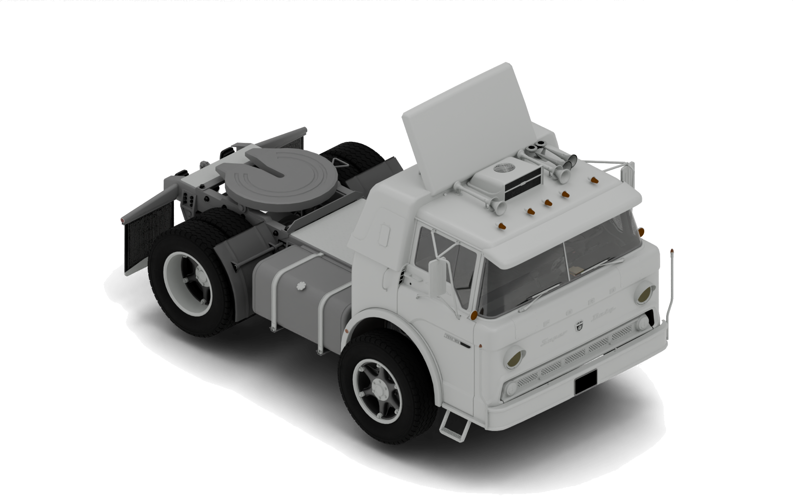
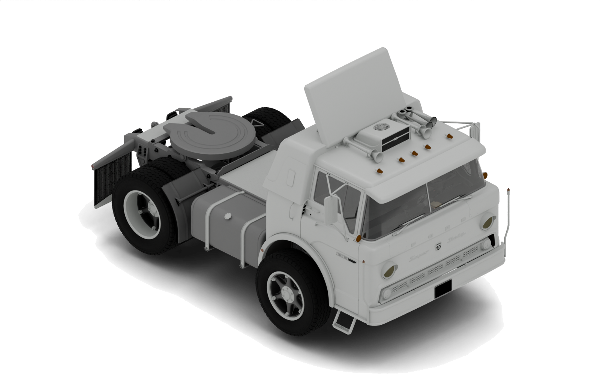
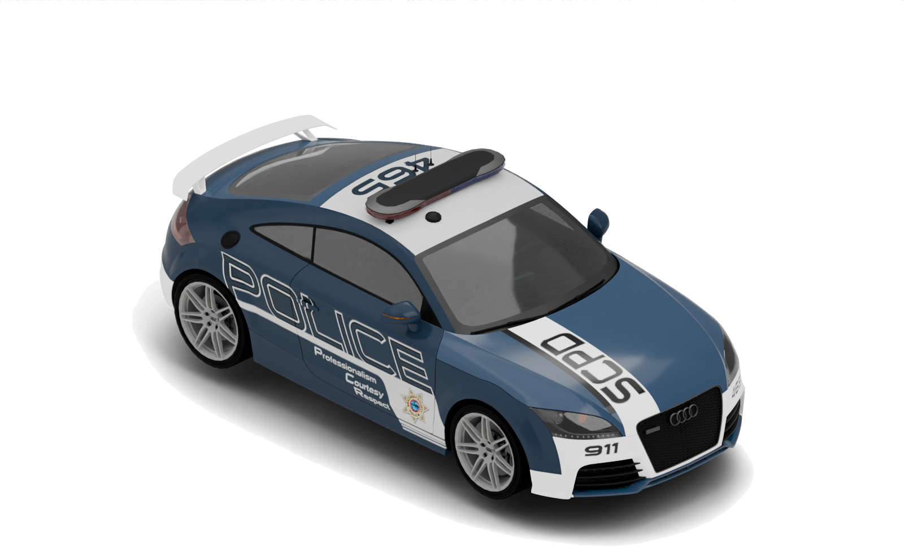
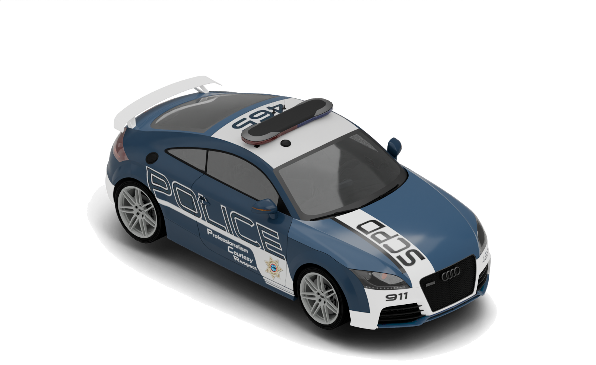
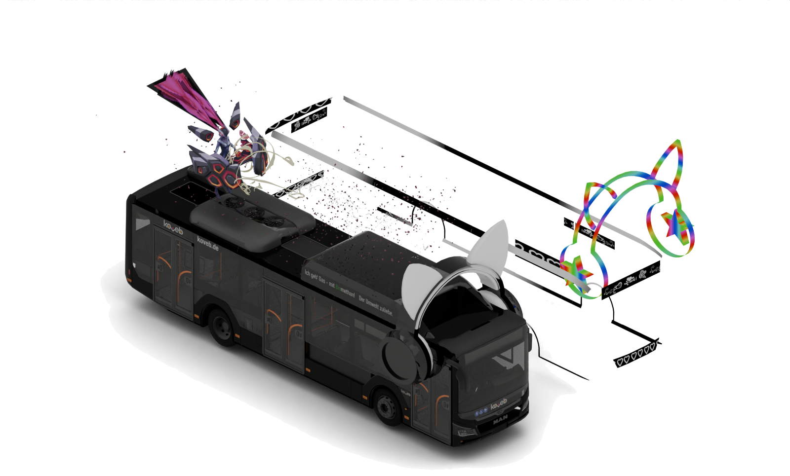
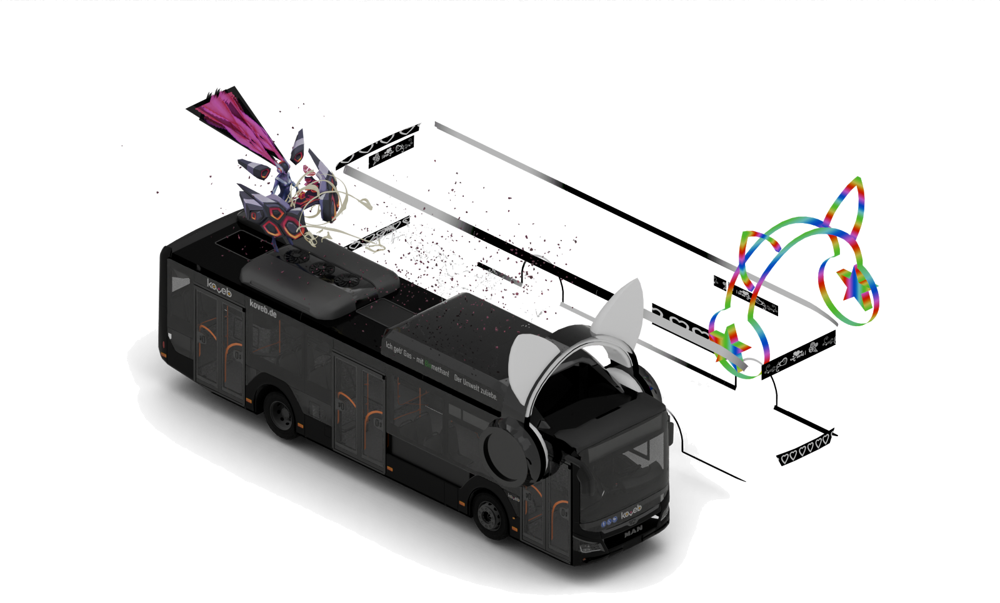
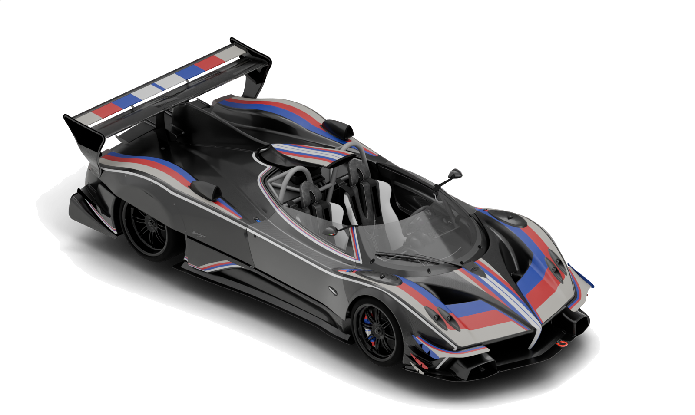
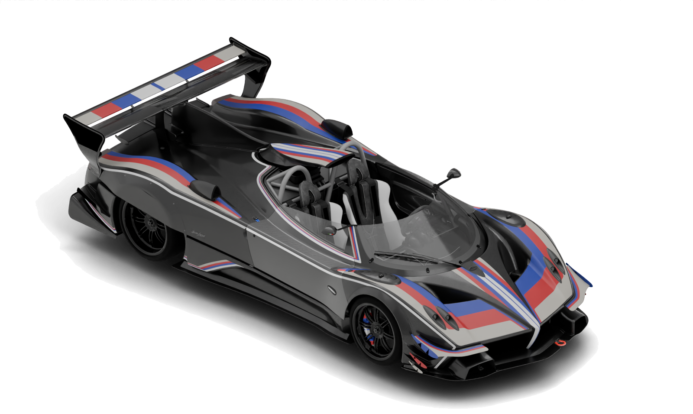
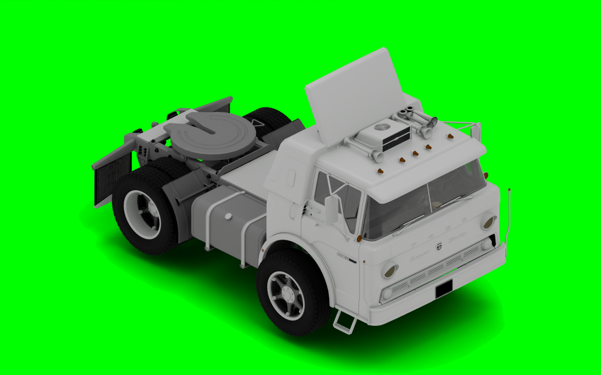

# Vehicle Renderer

作者：JACK  
联系方式：QQ 2518926462

基于 Blender、Sollumz 和 CodeWalker 相关运行工具的 FiveM/GTA V 车辆批量渲染器。指定一个车辆资源目录后，工具会自动解包压缩包/RPF、提取 YTD 贴图、导入 YFT 模型，并输出车辆 PNG。

## 效果示例

白底样图和抠像后透明 PNG：

| 车型 | 白底样图 | 抠像后透明 PNG |
| --- | --- | --- |
| fordc72 |  |  |
| 10ttrsscpd |  |  |
| 16MANDBS111 |  |  |
| zondarevob |  |  |

绿幕预览：



## 功能

- 递归扫描指定文件夹，识别 `.yft` / `_hi.yft` 车辆模型。
- 自动解包 `.zip`、`.rar`、`.7z` 和 `.rpf`，支持压缩包里再套 RPF。
- 自动读取车辆 `.ytd` 和根目录 `vehshare.ytd` 共享贴图。
- 使用 CodeWalker 相关 `YtdTools.exe` 提取贴图，使用 `texconv.exe` 转 PNG。
- Blender 后台导入模型、绑定贴图、补齐缺失车轮、修正玻璃/车轮基础材质。
- `--workers` 多进程并发渲染。
- `--cutout` 使用 Cycles studio 灯光输出最终透明裁切 PNG，保留车漆高光、环境反射和半透明地面阴影。
- 同时保留 `_greenscreen` 绿幕预览和 `_alpha` 原始透明图。
- `--key-green` 可单独处理已有绿幕 PNG/文件夹，输出透明 PNG 并裁切空白。

## 快速使用

在 FiveM 工程根目录运行：

```powershell
python ".\[Tool]\vehicle_renderer\render_all_vehicles.py" ".\[Tool]\TestVeh" --workers 2 --force --cutout
```

输出目录：

```text
<输入目录>\_vehicle_renders
```

最终透明 PNG 会直接放在 `_vehicle_renders` 根目录。

文档展示图放在：

```text
docs/images/*_white.png     # 白底样图
docs/images/*_cutout.png    # 抠像后透明 PNG
```

## 内置运行资源

仓库内只需要带运行必需文件：

```text
vehicle_renderer/
  vehshare.ytd
  tools/
    7z.exe
    7z.dll
    RpfTools.exe
    RpfTools.exe.config
    YtdTools.exe
    YtdTools.exe.config
    CodeWalker.Core.dll
    SharpDX.dll
    SharpDX.Mathematics.dll
    texconv.exe
```

`tools/` 会优先于外部路径使用。源码项目、调试符号和临时工程不需要放进仓库。

## 常用命令

只渲染指定车型：

```powershell
python ".\[Tool]\vehicle_renderer\render_all_vehicles.py" "D:\cars" --model police --model sultan --workers 2 --cutout
```

指定输出目录：

```powershell
python ".\[Tool]\vehicle_renderer\render_all_vehicles.py" "D:\cars" --out "D:\vehicle_images" --workers 4 --cutout
```

只做普通白底渲染：

```powershell
python ".\[Tool]\vehicle_renderer\render_all_vehicles.py" "D:\cars" --workers 2 --force
```

`--cutout` 默认已经使用偏亮的 studio 灯光。需要微调时：

```powershell
python ".\[Tool]\vehicle_renderer\render_all_vehicles.py" "D:\cars" --cutout --exposure 0.35 --world-strength 0.66 --light-scale 1.45
```

关闭自动解包：

```powershell
python ".\[Tool]\vehicle_renderer\render_all_vehicles.py" "D:\cars" --no-unpack
```

单独绿幕抠图：

```powershell
python ".\[Tool]\vehicle_renderer\render_all_vehicles.py" --key-green "D:\green_pngs" --key-out "D:\cutout_pngs"
```

## 输出结构

`--cutout` 模式：

```text
_vehicle_renders/
  fordc72.png              # 最终透明裁切 PNG
  10ttrsscpd.png
  _alpha/
    fordc72.png            # Blender 原始透明渲染
  _greenscreen/
    fordc72.png            # 带绿幕背景的预览图
  _textures/
    fordc72/
      *.png
  _jobs/
    fordc72.json
  _logs/
    fordc72.log
    fordc72.textures.log
```

`--cutout` 输出的透明 PNG 不是纯抠边，车身反光和地面阴影会一起保留在 alpha 里；放到白底或网页背景上仍能看到落地阴影。

## 已验证

测试目录：

```powershell
python ".\[Tool]\vehicle_renderer\render_all_vehicles.py" ".\[Tool]\TestVeh" --workers 2 --force --cutout
```

结果：

```text
[archive] unpack 16MANDBS111...zip
[archive] unpack f6dace-Pag1734786910.rar
[rpf] unpack ...\dlc.rpf
[ok] fordc72
[ok] 10ttrsscpd
[ok] zondarevob
[ok] 16MANDBS111
Done. OK=4 FAIL=0
```

## 参考

- [dexyfex/CodeWalker](https://github.com/dexyfex/CodeWalker)
- [Sollumz/Sollumz](https://github.com/Sollumz/Sollumz)
